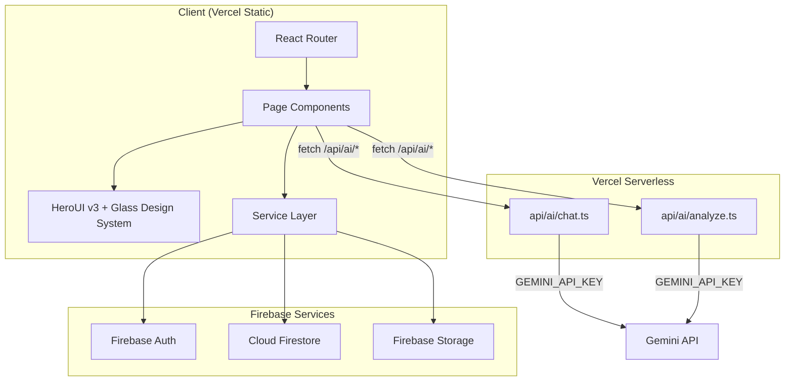
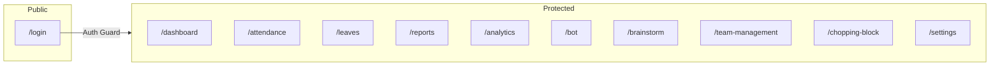

# Design Document: Production Hosting Readiness

## Overview

This design transforms FounderTrack from a prototype into a production-ready application deployed on Vercel with Firebase backend services. The work spans 17 requirements covering security (API key removal, Firestore rules), data integrity (real computed metrics, Firebase Storage for photos, atomic admin assignment), UX improvements (routing, pagination, toast notifications, loading states, dark mode), codebase health (monolith decomposition), and a complete visual identity system built on HeroUI v3 with a skeuomorphic glass aesthetic.

The current application is a ~2800-line monolith (`App.tsx`) using raw Tailwind utility classes, `alert()` calls, hardcoded statistics, base64 photos in Firestore, and an exposed Gemini API key injected via Vite `define`. The target state is a modular, routed, visually polished application with server-side AI proxying, real-time computed metrics, and a cohesive design system.

## Architecture

### High-Level Architecture



### Deployment Architecture

- Static SPA built by Vite, deployed to Vercel's CDN
- Serverless functions in `api/` directory handle AI proxy requests
- Firebase Auth, Firestore, and Storage remain as managed backend services
- `vercel.json` configures SPA fallback and API routing

### Routing Architecture



`react-router-dom` with `BrowserRouter` replaces the `activeTab` state. A `<ProtectedRoute>` wrapper checks `user` auth state and redirects unauthenticated users to `/login`. An `<AdminRoute>` wrapper additionally checks `profile.role === 'admin'` for admin-only pages.

## Components and Interfaces

### Refactored File Structure

```
src/
├── main.tsx                          # BrowserRouter + HeroUIProvider + ThemeProvider
├── App.tsx                           # Routes, auth state, layout shell only
├── index.css                         # Tailwind imports, CSS variables, glass layers, animations
├── firebase.ts                       # Firebase init (unchanged)
├── types.ts                          # Shared TypeScript types (add SessionState)
├── lib/
│   ├── utils.ts                      # cn() utility (unchanged)
│   ├── variants.ts                   # tv() variant system (skeuButtonVariants, card, badge)
│   └── constants.ts                  # Configurable values (shift duration, leave allowances, page sizes)
├── hooks/
│   ├── useAuth.ts                    # Auth state + profile loading (extracted from App.tsx)
│   ├── useTheme.ts                   # Dark/light mode with localStorage persistence
│   └── usePagination.ts             # Firestore cursor-based pagination hook
├── components/
│   ├── layout/
│   │   ├── Sidebar.tsx               # Redesigned: 220px, solid bg, golden gradient, StatusDot
│   │   ├── Header.tsx                # Extracted: title, notifications (no search bar)
│   │   ├── ProtectedRoute.tsx        # Auth guard wrapper
│   │   └── AdminRoute.tsx            # Admin role guard wrapper
│   ├── ui/
│   │   ├── StatusDot.tsx             # Session state indicator with pulse animation
│   │   ├── Toast.tsx                 # Toast notification system (info/success/warning/error)
│   │   ├── ToastProvider.tsx         # Context provider for toast state
│   │   ├── StatCard.tsx              # Extracted from App.tsx, uses HeroUI Card
│   │   ├── AttendanceRow.tsx         # Extracted from App.tsx
│   │   └── RoleSelection.tsx         # Extracted from App.tsx, removes "founder" option
│   ├── pages/
│   │   ├── LoginPage.tsx             # Login screen
│   │   ├── DashboardPage.tsx         # Employee dashboard (shift, todos, report link)
│   │   ├── AttendancePage.tsx        # Attendance log with computed stats + pagination
│   │   ├── LeavesPage.tsx            # Leave/WFH requests with computed balances
│   │   ├── ReportsPage.tsx           # Daily reports grid
│   │   ├── AnalyticsPage.tsx         # Admin analytics with computed metrics
│   │   ├── BotPage.tsx               # AI bot chat (uses /api/ai/chat)
│   │   ├── BrainstormPage.tsx        # Ideas forum
│   │   ├── TeamManagementPage.tsx    # Admin team management
│   │   ├── ChoppingBlockPage.tsx     # Founder governance (wraps existing component)
│   │   └── SettingsPage.tsx          # Profile, preferences, dark mode toggle
│   └── ErrorBoundary.tsx             # Existing (restyle with HeroUI)
├── services/
│   ├── aiService.ts                  # Refactored: calls /api/ai/* instead of Gemini directly
│   ├── dataService.ts                # Add pagination support, summary computation
│   ├── storageService.ts             # NEW: Firebase Storage upload for check-in photos
│   └── statsService.ts              # NEW: Pure functions for computing attendance/analytics stats
api/
├── ai/
│   ├── chat.ts                       # Vercel serverless: AI bot proxy
│   └── analyze.ts                    # Vercel serverless: performance analysis proxy
```

### Vercel Serverless Functions (Requirement 1)

Each function in `api/ai/` follows this pattern:

```typescript
// api/ai/chat.ts
import type { VercelRequest, VercelResponse } from '@vercel/node';

export default async function handler(req: VercelRequest, res: VercelResponse) {
  // 1. Verify Firebase ID token from Authorization header
  // 2. Extract user message + summary data from request body
  // 3. Call Gemini API using server-side GEMINI_API_KEY env var
  // 4. Return response to client
}
```

Token verification uses the Firebase Admin SDK (`firebase-admin`) initialized with the project credentials. The `GEMINI_API_KEY` is stored in Vercel environment variables, never exposed to the client.

The `vite.config.ts` `define` block that injects `process.env.GEMINI_API_KEY` into the client bundle is removed.

### Firebase Storage Service (Requirement 2)

```typescript
// src/services/storageService.ts
import { getStorage, ref, uploadBytes, getDownloadURL } from 'firebase/storage';

export async function uploadCheckInPhoto(
  uid: string,
  date: string,
  file: Blob,
  filename: string
): Promise<string> {
  const storage = getStorage();
  const path = `check-in-photos/${uid}/${date}/${filename}`;
  const storageRef = ref(storage, path);
  await uploadBytes(storageRef, file);
  return getDownloadURL(storageRef);
}
```

The existing `processImage` function in `App.tsx` is modified to produce a `Blob` instead of a base64 data URL. The download URL is stored in the Firestore attendance document's `checkInPhoto` field.

Firebase Storage security rules:

```
rules_version = '2';
service firebase.storage {
  match /b/{bucket}/o {
    match /check-in-photos/{uid}/{allPaths=**} {
      allow read: if request.auth != null && 
        (request.auth.uid == uid || 
         firestore.get(/databases/(default)/documents/users/$(request.auth.uid)).data.role == 'admin');
      allow write: if request.auth != null && 
        request.auth.uid == uid && 
        request.resource.size < 5 * 1024 * 1024;
    }
  }
}
```

### Stats Service (Requirements 3, 4, 5, 6)

Pure functions that compute real metrics from Firestore data:

```typescript
// src/services/statsService.ts

export function computeAvgShiftDuration(records: AttendanceRecord[]): number;
export function computeOnTimePercentage(records: AttendanceRecord[], expectedStartHour: number): number;
export function computeAvgTaskCompletionRate(reports: DailyReport[]): number;
export function computeLeaveBalance(leaves: LeaveRequest[], type: 'leave' | 'wfh', year: number, allowance: number): { used: number; total: number };
export function computeShiftProgress(checkInTime: Date, expectedDurationHours: number): number;
```

These are pure functions with no side effects, making them ideal for property-based testing.

### Toast Notification System (Requirement 17, criteria 27-29)

```typescript
// src/components/ui/ToastProvider.tsx
interface Toast {
  id: string;
  message: string;
  variant: 'info' | 'success' | 'warning' | 'error';
  duration?: number; // default 4000ms
}

// Context provides: addToast(message, variant, duration?)
// Renders toast stack using HeroUI Alert with AnimatePresence
// Auto-dismiss via setTimeout
```

All `alert()` calls throughout the codebase are replaced with `addToast()`.

### Theme System (Requirement 17, criteria 32-34, 51-54)

```typescript
// src/hooks/useTheme.ts
export function useTheme(): {
  theme: 'dark' | 'light';
  toggleTheme: () => void;
  setTheme: (theme: 'dark' | 'light') => void;
}
```

- On mount: check `localStorage.getItem('theme')`, fall back to `prefers-color-scheme`
- On toggle: update `localStorage`, set `data-theme` attribute on `<html>`
- Dark mode is the default theme
- CSS custom variables on `:root` and `[data-theme="dark"]` drive all color changes

### Pagination Hook (Requirement 15)

```typescript
// src/hooks/usePagination.ts
export function usePagination<T>(
  collectionPath: string,
  pageSize: number,
  orderByField: string,
  constraints?: QueryConstraint[]
): {
  items: T[];
  loading: boolean;
  hasMore: boolean;
  loadMore: () => void;
}
```

Uses Firestore `startAfter` with the last document snapshot as cursor. Page size defaults to 20 for attendance records.

### Variant System (Requirement 17, criteria 16-24)

```typescript
// src/lib/variants.ts
import { tv } from '@heroui/styles';
import { buttonVariants, cardVariants } from '@heroui/styles';

export const skeuButtonVariants = tv({
  extend: buttonVariants,
  variants: {
    variant: {
      primary: '...gradient gold, inset highlight, bottom shadow...',
      secondary: '...',
      tertiary: '...',
      danger: '...',
      ghost: '...subtle gradient, minimal shadow...',
    },
    size: { sm: '...', md: '...', lg: '...' },
  },
});

export const glassCardVariants = tv({
  extend: cardVariants,
  variants: {
    variant: {
      glass: 'glass',
      elevated: 'glass-elevated',
      inset: 'inset-well',
      flat: '...',
    },
    size: { sm: '...', md: '...', lg: '...' },
  },
});

export const badgeVariants = tv({ ... });
```

### StatusDot Component (Requirement 17, criteria 43-47)

```typescript
// src/components/ui/StatusDot.tsx
interface StatusDotProps {
  state: 'active' | 'on-break' | 'away' | 'offline';
  size?: 'sm' | 'md' | 'lg';
}
```

- `active`: gold circle with emerald green ping animation
- `on-break`: static amber/orange circle
- `away`: static muted gray circle
- `offline`: very faint muted circle

### Sidebar Redesign (Requirement 17, criteria 36-42)

The sidebar is rebuilt with:
- 220px fixed width, solid background (not glass)
- Golden gradient "K" logo mark with inset highlight
- Nav items grouped: "Core" (Dashboard, Team, Tasks, Review) and "Team Ops" (Analytics, Attendance, Leave, Bot, etc.) with visual dividers
- Active item: golden gradient background with 3D button treatment
- Hover on non-active: subtle accent background
- Bottom section: user avatar with StatusDot, theme toggle above it
- Uses `react-router-dom` `NavLink` for active state detection

## Data Models

### Updated Types

```typescript
// Additions to src/types.ts

export type SessionState = 'active' | 'on-break' | 'away' | 'offline';

export type Theme = 'dark' | 'light';

// AttendanceRecord.checkInPhoto changes from base64 string to Firebase Storage URL
// (no type change needed, still string, but semantics change)

// AI proxy request/response types
export interface AIChatRequest {
  message: string;
  summary: {
    totalUsers: number;
    totalAttendanceRecords: number;
    avgHours: number;
    taskCompletionRate: number;
    recentRecords: AttendanceRecord[]; // max 50
  };
}

export interface AIChatResponse {
  text: string;
}

export interface AIAnalyzeRequest {
  userData: Array<{
    uid: string;
    name: string;
    role: string;
    totalHours: number;
    completedTasks: number;
    totalTasks: number;
    completionRate: number;
  }>;
}
```

### Firestore Security Rules Updates (Requirements 8, 14)

The existing rules already prevent non-admin users from setting `role` to `admin` on create. The updates needed:

1. Add explicit prevention of `founder` role self-assignment (already partially there via `isValidUser` allowing `founder` in the enum but `create` rule requiring `employee` or `intern` unless `isAdmin()`).

2. The existing create rule: `allow create: if ... (request.resource.data.role in ['employee', 'intern'] || isAdmin())` already handles Requirement 14. We need to also ensure `update` prevents role escalation to `founder`:

```
allow update: if isAuthenticated() && (isOwner(uid) || isAdmin()) && isValidUser(request.resource.data) && 
  (
    (isOwner(uid) && request.resource.data.role == resource.data.role) || 
    isAdmin()
  );
```

This is already in place. The client-side change removes "founder" from the `RoleSelection` component options.

### Atomic Admin Assignment (Requirement 8)

Replace the current non-atomic first-user check:

```typescript
// Current (race condition):
const usersSnap = await getDocs(query(collection(db, 'users'), limit(1)));
if (usersSnap.empty) {
  await setDoc(doc(db, 'users', firebaseUser.uid), firstProfile);
}

// Fixed (atomic):
import { runTransaction } from 'firebase/firestore';

await runTransaction(db, async (transaction) => {
  const usersSnap = await getDocs(query(collection(db, 'users'), where('role', '==', 'admin'), limit(1)));
  if (usersSnap.empty) {
    transaction.set(doc(db, 'users', firebaseUser.uid), { ...firstProfile, role: 'admin' });
  } else {
    // Another user already claimed admin
    return 'not-admin';
  }
});
```

Note: Firestore transactions with queries have limitations. The implementation will use a sentinel document (`settings/admin-assigned`) as a lock within the transaction to ensure atomicity.

### Vercel Configuration (Requirement 10)

```json
// vercel.json
{
  "rewrites": [
    { "source": "/api/(.*)", "destination": "/api/$1" },
    { "source": "/((?!api/).*)", "destination": "/index.html" }
  ]
}
```

### HTML Metadata (Requirement 11)

```html
<title>FounderTrack</title>
<link rel="icon" type="image/svg+xml" href="/favicon.svg" />
<meta property="og:title" content="FounderTrack" />
<meta property="og:description" content="Workspace management and team tracking platform" />
<meta property="og:type" content="website" />
```

### CSS Architecture (Requirement 17)

The `src/index.css` file is restructured:

```css
@import "tailwindcss";

/* CSS Custom Variables */
:root {
  --accent: 36 95% 46%;           /* light mode gold */
  --bg-primary: 42 25% 97%;       /* warm cream */
  --bg-surface: 0 0% 100%;
  --text-primary: 225 15% 15%;
  --glass-blur: 22px;
  --glass-elevated-blur: 28px;
  /* ... more variables */
}

[data-theme="dark"] {
  --accent: 40 95% 52%;           /* dark mode gold */
  --bg-primary: 225 15% 7%;       /* deep blue-gray */
  --bg-surface: 225 12% 10%;
  --text-primary: 0 0% 95%;
  /* ... more variables */
}

/* Glass surfaces in @layer components */
@layer components {
  .glass { /* backdrop-blur, inset highlights, layered shadows, noise texture */ }
  .glass-elevated { /* heavier blur, more prominent highlights */ }
  .inset-well { /* inward shadows for pressed-in appearance */ }
}

/* CSS Animations */
@keyframes glow-pulse { /* 4s breathing glow */ }
@keyframes float { /* 5s vertical bob */ }
@keyframes breathe { /* 3s opacity pulse */ }
@keyframes slide-up-fade { /* 350ms entry */ }
@keyframes scale-in { /* 250ms scale entry */ }

/* Custom scrollbar, focus rings, gradient dividers */
```


## Correctness Properties

*A property is a characteristic or behavior that should hold true across all valid executions of a system — essentially, a formal statement about what the system should do. Properties serve as the bridge between human-readable specifications and machine-verifiable correctness guarantees.*

### Property 1: Storage path follows convention

*For any* valid uid string, date string (YYYY-MM-DD), and filename string, the `uploadCheckInPhoto` function SHALL construct a Firebase Storage path matching the pattern `check-in-photos/{uid}/{date}/{filename}`.

**Validates: Requirements 2.1**

### Property 2: Average shift duration is correct

*For any* non-empty array of AttendanceRecord objects where at least one record has both `checkInTime` and `checkOutTime`, the `computeAvgShiftDuration` function SHALL return a value equal to the sum of individual shift durations divided by the count of records with both timestamps.

**Validates: Requirements 3.1**

### Property 3: On-time arrival percentage is correct

*For any* non-empty array of AttendanceRecord objects with `checkInTime` values and any valid expected start hour (0-23), the `computeOnTimePercentage` function SHALL return a value equal to (count of records where checkInTime <= expected start time) / (total records with checkInTime) * 100, and the result SHALL always be between 0 and 100 inclusive.

**Validates: Requirements 3.2**

### Property 4: Task completion rate is correct

*For any* non-empty array of DailyReport objects with todoList entries, the `computeAvgTaskCompletionRate` function SHALL return a value equal to (total completed tasks across all reports) / (total tasks across all reports) * 100, and the result SHALL always be between 0 and 100 inclusive.

**Validates: Requirements 4.1**

### Property 5: Leave/WFH balance computation

*For any* array of LeaveRequest objects, any type filter ('leave' | 'wfh'), any year, and any total allowance, the `computeLeaveBalance` function SHALL return a `used` count equal to the number of requests where `status === 'approved'` AND `type` matches the filter AND the request falls within the specified year, and `total` equal to the allowance.

**Validates: Requirements 5.2, 5.3**

### Property 6: Shift progress computation with cap

*For any* valid checkInTime (Date) and expected duration in hours (positive number), the `computeShiftProgress` function SHALL return a value equal to `min(100, (elapsedHours / expectedDuration) * 100)`, and the result SHALL always be between 0 and 100 inclusive.

**Validates: Requirements 6.1, 6.3**

### Property 7: Auth guard redirects unauthenticated users

*For any* protected URL path in the application's route configuration, when no authenticated user is present, the ProtectedRoute component SHALL redirect to the `/login` path.

**Validates: Requirements 9.5**

### Property 8: AI context summarization reduces payload size

*For any* dataset containing users, attendance records, and daily reports, the `summarizeForAI` function SHALL produce a payload that contains the required summary fields (totalUsers, totalAttendanceRecords, avgHours, taskCompletionRate) and the serialized summary SHALL be smaller than or equal to the serialized raw dataset.

**Validates: Requirements 12.1, 12.2**

### Property 9: Dataset truncation to 50 records

*For any* array of records with length > 50, the truncation function SHALL return exactly 50 records, and those records SHALL be the 50 most recent (by date, descending).

**Validates: Requirements 12.3**

### Property 10: StatusDot maps session state to correct visual

*For any* valid SessionState ('active' | 'on-break' | 'away' | 'offline'), the StatusDot component SHALL render with the correct color class and SHALL include a pulse animation if and only if the state is 'active'.

**Validates: Requirements 17 (criteria 43-47)**

## Error Handling

### AI Proxy Errors

- Invalid/missing Firebase ID token → HTTP 401 with `{ error: 'Unauthorized' }`
- Gemini API failure (rate limit, server error) → HTTP 502 with `{ error: 'AI service unavailable' }`, client shows toast with error variant
- Malformed request body → HTTP 400 with `{ error: 'Invalid request' }`

### Firebase Storage Errors

- Upload exceeds 5MB → Client-side validation before upload, toast warning
- Network failure during upload → Retry with exponential backoff (1 attempt), then toast error
- Permission denied → Toast error "Unable to upload photo"

### Firestore Errors

- Transaction conflict (admin race condition) → Transaction retries automatically (Firestore built-in), fallback assigns non-admin role
- Permission denied on role escalation → Toast error, no state change
- Network offline → Firestore offline persistence handles reads; writes queue until reconnection

### Routing Errors

- Unknown URL path → Redirect to `/dashboard` (authenticated) or `/login` (unauthenticated)
- Admin-only route accessed by non-admin → Redirect to `/dashboard`

### General

- All `alert()` calls replaced with toast notifications using appropriate variants (info, success, warning, error)
- ErrorBoundary catches unhandled React errors and displays a recovery UI

## Testing Strategy

### Property-Based Tests

Property-based testing is appropriate for this feature because several requirements involve pure computation functions (stats, balances, progress, summarization) with clear input/output behavior and large input spaces.

Library: `fast-check` (TypeScript PBT library)
Configuration: Minimum 100 iterations per property test.

Each property test references its design document property:
- Tag format: `Feature: production-hosting-readiness, Property {N}: {title}`

Properties 1-6 and 8-9 test pure functions in `statsService.ts`, `storageService.ts`, and `dataService.ts`. Property 7 tests the ProtectedRoute component. Property 10 tests the StatusDot component.

### Unit Tests (Example-Based)

- AI proxy handler: mock Firebase Admin + Gemini SDK, test auth flow (valid token, invalid token, missing token)
- RoleSelection component: verify only "employee" and "intern" options rendered
- Header component: verify correct title for each route, verify no search bar
- Toast system: verify auto-dismiss timing, verify variant rendering
- Theme hook: verify localStorage persistence, verify data-theme attribute, verify OS preference fallback
- Variant functions: verify each variant produces expected class strings
- Sidebar: verify nav items render, verify active state styling

### Integration Tests

- Firebase Storage upload flow (with emulator): upload file, verify download URL works
- Firestore security rules (with emulator): test role creation/update restrictions
- Firestore transaction for admin assignment (with emulator): simulate concurrent signups
- Pagination with Firestore (with emulator): verify cursor-based queries return correct pages

### Smoke Tests

- `vercel.json` exists and contains required rewrite rules
- `index.html` contains correct title, favicon, and OG meta tags
- CSS custom variables defined for both themes
- Glass surface classes exist in CSS
- Animation keyframes defined
- Package.json contains required dependencies
